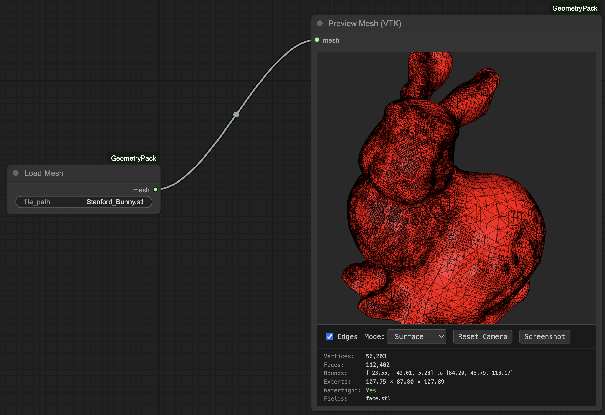
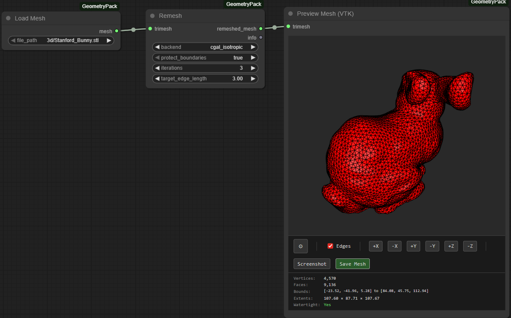

# ComfyUI-GeometryPack

**⚠️ Work in Progress** - Active development, expect breaking changes.

Professional geometry processing nodes for ComfyUI. Load, analyze, remesh, unwrap, and visualize 3D meshes directly in your workflows.




## Features

**Core Operations**
- Load/Save meshes (OBJ, PLY, STL, OFF, etc.)
- Primitive generation (cube, sphere, plane)
- Mesh analysis and statistics
- Interactive 3D preview (Three.js & VTK.js)

**Remeshing**
- PyMeshLab isotropic remeshing
- CGAL isotropic remeshing (optional)
- Blender voxel & quadriflow remeshing

**UV Mapping**
- xAtlas UV unwrapping (fast, no dependencies)
- libigl LSCM conformal mapping
- Blender projections (cube, cylinder, sphere)

**Analysis**
- Boundary edge detection
- Hausdorff & Chamfer distance
- Signed distance fields (SDF)
- Point cloud conversion

## Installation

```bash
cd ComfyUI/custom_nodes/
git clone https://github.com/yourusername/ComfyUI-GeometryPack.git
cd ComfyUI-GeometryPack
pip install -r requirements.txt
```

**Automatic Blender Installation (Recommended):**
```bash
python install.py
```

This will automatically download and install a portable version of Blender for UV unwrapping and remeshing nodes. No admin rights required!

Restart ComfyUI. Nodes appear in the `geompack/` category.

**Optional Dependencies:**
- **Blender**: Auto-installed via `install.py`, or install manually from [blender.org](https://www.blender.org/download/)
- **CGAL**: Build tools for CGAL remeshing (see `cgal_tools/README.md`)

## Quick Start

**Basic workflow:**
```
Create Primitive → Mesh Info → Preview Mesh (3D)
Load Mesh → PyMeshLab Remesh → Save Mesh
```

## Architecture

Codebase organized by function in `nodes/` directory:
- **io.py** - Load/Save
- **primitives.py** - Shape generation
- **analysis.py** - Mesh info, boundary detection
- **distance.py** - Hausdorff, Chamfer, SDF
- **conversion.py** - Mesh to point cloud
- **remeshing.py** - PyMeshLab, CGAL, Blender
- **uv.py** - UV unwrapping (xAtlas, libigl, Blender)
- **transforms.py** - Positioning
- **visualization.py** - 3D preview (Three.js, VTK.js)

All nodes use `trimesh.Trimesh` objects for mesh data.

## Credits

Built on [trimesh](https://trimesh.org/), [libigl](https://libigl.github.io/), [PyMeshLab](https://pymeshlab.readthedocs.io/), and [CGAL](https://www.cgal.org/).

## License

MIT License - See LICENSE file for details
